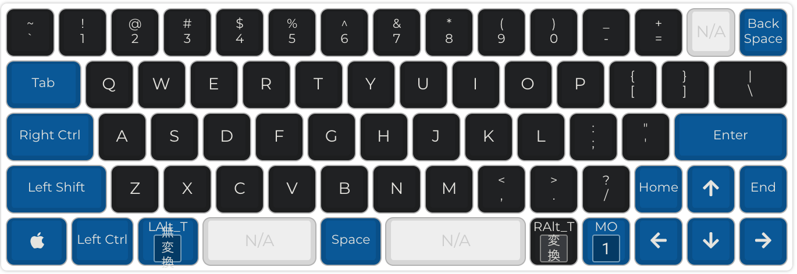
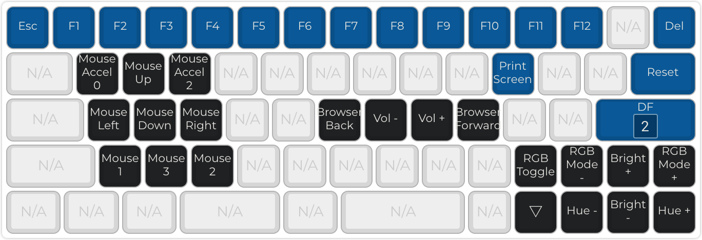
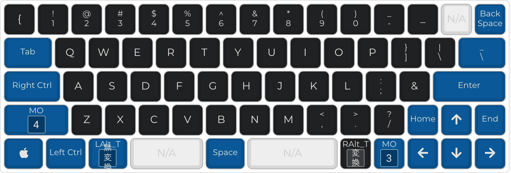
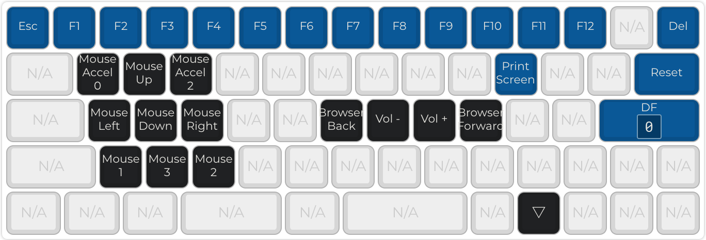
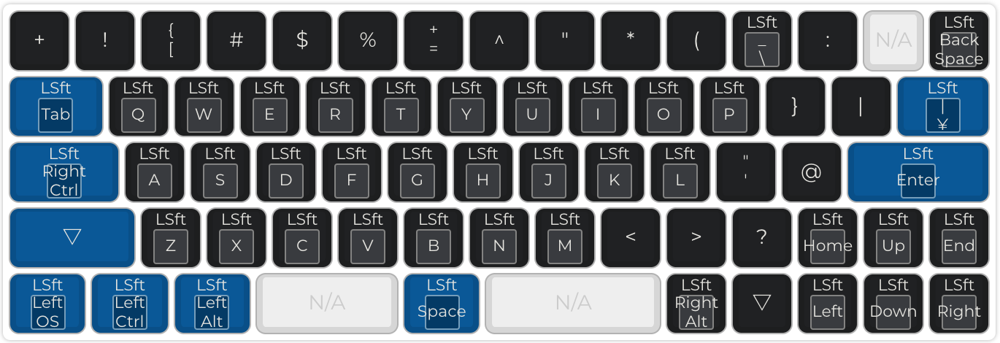

# jis2us-dz60-keymap

## Layers
### layer0

### layer1

### layer2

### layer3

### layer4

To make use of this file you will need follow the following steps:

* Download or Clone QMK Firmware: <https://github.com/qmk/qmk_firmware/>
* Extract QMK Firmware to a location on your hard drive
* Copy this folder into `qmk_firmware/keyboards/dz60/keymaps/`
* You are now ready to compile or use your keymap with the source

More information can be found in the QMK docs: <https://docs.qmk.fm>
